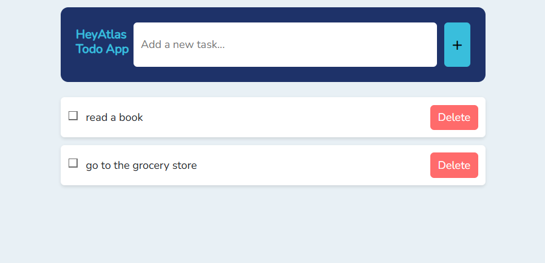
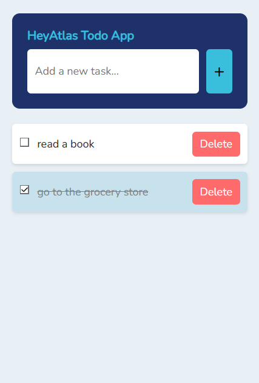

# Laravel & Vue Todo List Application

This is a simple Todo List application built using Laravel and Vue.js. The application allows users to dynamically add, view, update, and delete todos. This project follows modern development practices, including the use of SOLID principles, PSR-2 coding standards, and the Airbnb JavaScript Style Guide.

## Features

- Add new todos to the list
- Mark todos as completed or uncompleted
- Delete todos from the list
- View the entire todo list

## Demo Video


## Screenshots




## Technologies Used

- **Backend:**
  - Laravel 9
  - PHP
  - MySQL (PhpMyAdmin)
  
- **Frontend:**
  - Vue.js
  - Vite
  - Bootstrap
  - Sass (for CSS preprocessing)

- **Development Tools:**
  - Laravel Mix (for asset compilation)
  - Vite (for hot module replacement and faster development)
  - npm (for managing JavaScript dependencies)
  - Composer (for managing PHP dependencies)

## Getting Started

### Prerequisites

Before you begin, make sure you have the following installed on your system:

- PHP >= 8.0
- Composer
- Node.js & npm
- MySQL (or another SQL database)
- Git

### Installation

Follow these steps to set up the project on your local machine:

1. **Clone the repository:**

   ```
   git clone https://github.com/yigittaskin/laravel-vue-todo-app.git
   cd laravel-vue-todo-app
   ```

2. **Install PHP dependencies:**

   Use Composer to install the necessary PHP packages.

   ```
   composer install
   ```

3. **Install JavaScript dependencies:**

   Use npm to install the necessary JavaScript packages.

   ```
   npm install
   ```

4. **Environment Setup:**

   Copy the `.env.example` file to create a new `.env` file.

   ```
   cp .env.example .env
   ```

   Open the `.env` file and configure your database settings:

   ```
   DB_DATABASE=your_database_name
   DB_USERNAME=your_database_user
   DB_PASSWORD=your_database_password
   ```

5. **Run Database Migrations:**

   Set up the database tables by running the migrations.

   ```
   php artisan migrate
   ```

6. **Compile Assets:**

   Compile the front-end assets using Vite.

   ```
   npm run dev
   ```

7. **Serve the Application:**

   Start the Laravel development server.

   ```
   php artisan serve
   ```

8. **Access the Application:**

   Open your web browser and navigate to:

   ```
   http://127.0.0.1:8000
   ```

### Project Structure

- **app/Models/Todo.php:** The model representing a Todo item.
- **app/Http/Controllers/API/TodoController.php:** The controller handling API requests for todos.
- **resources/js/components/TodoApp.vue:** The main Vue.js component for managing the todo list.
- **resources/views/welcome.blade.php:** The Blade template that serves as the entry point for the Vue.js application.
- **routes/api.php:** Defines API routes for the application.

### API Endpoints

- **GET /api/todos:** Retrieve the entire list of todos.
- **POST /api/todos:** Create a new todo.
- **GET /api/todos/{id}:** Retrieve a specific todo by ID.
- **PATCH /api/todos/{id}:** Update a specific todo by ID.
- **DELETE /api/todos/{id}:** Delete a specific todo by ID.

### Development Standards

This project adheres to the following coding standards:

- **SOLID Principles:** The application architecture follows SOLID principles to ensure maintainability and scalability.
- **PSR-2:** PHP code follows the PSR-2 coding standard for consistency and readability.
- **Airbnb JavaScript Style Guide:** JavaScript code follows the Airbnb style guide for clarity and uniformity.
